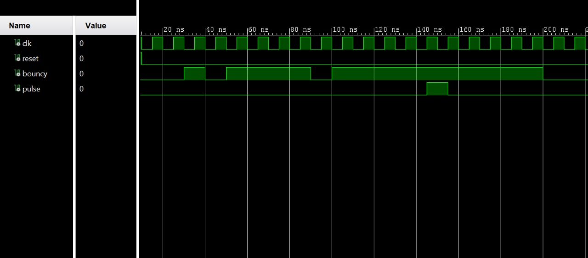
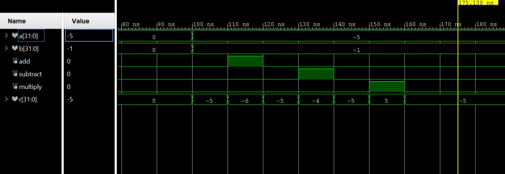
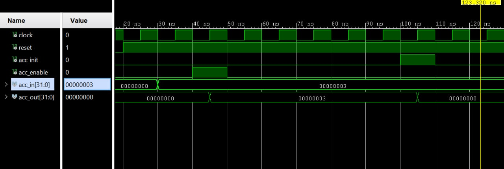

# FPGA Calculator 

Final project for the logic and sequential circuits coruse attended at University of Trento 
 
 --------

## Simple calculator with accumulator

| Architecture|
|--|
|| 

|Debouncer|--|
|--|--|
|||

| ALU |
|--|
||

|Accumulator|
|--|
||